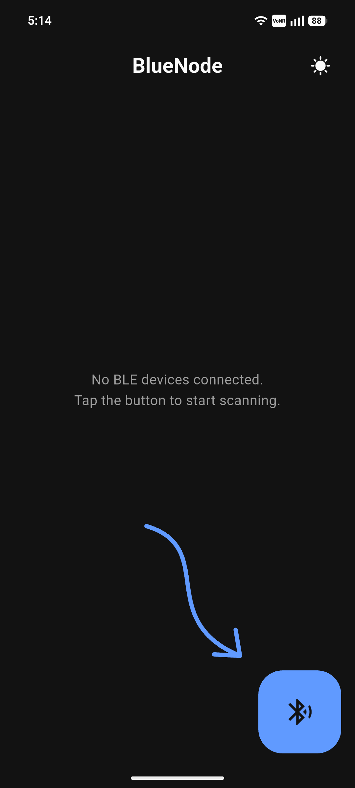
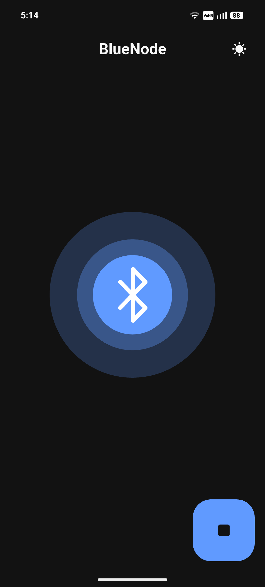
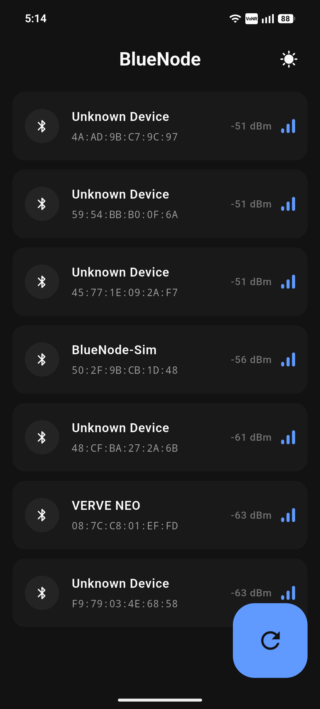
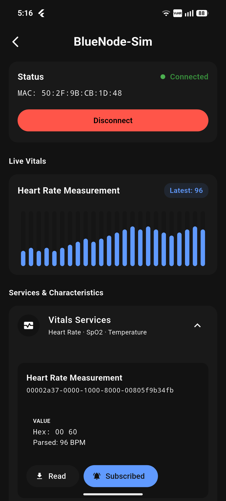
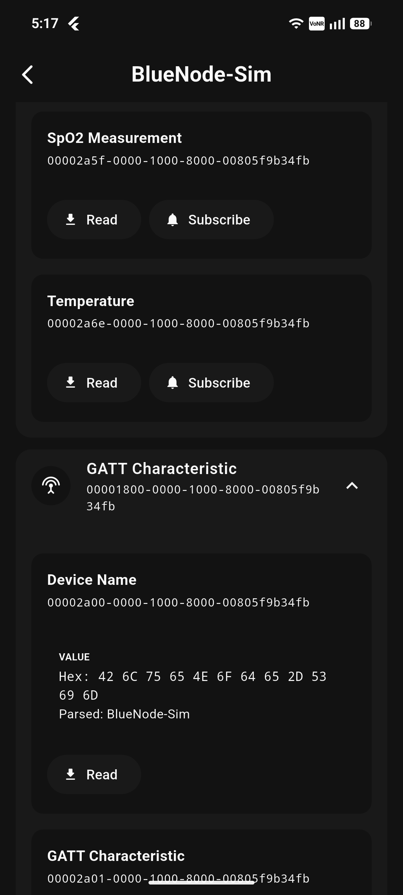
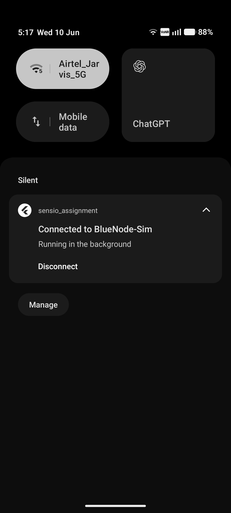
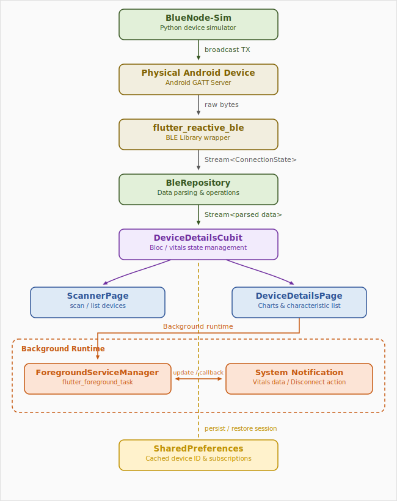

# BlueNode BLE Vitals Monitor (Sensio Assignment)

A Flutter application that scans and connects to Bluetooth Low Energy (BLE) devices to discover, read, write, and subscribe to telemetry characteristics. This project features **real-time vitals visualization (fl_chart)** and a **persistent foreground service** to maintain data streams in the background.

Additionally, a **BLE peripheral simulator** written in Python is included to mock a real health tracker broadcasting vitals (Heart Rate, SpO2, and Body Temperature).

---

## 📸 Screenshots & UI Tour

All screenshots are located in [assets/docs/](file:///Volumes/VAULT/Flutter_projects/sensio_assignment/assets/docs).
## Screenshots

<table>
<tr>
<td align="center">
<br>
<b>Scan Entry Screen</b>
</td>
<td align="center">
<br>
<b>Active BLE Scan</b>
</td>
<td align="center">
<br>
<b>Device Discovery</b>
</td>
</tr>
<tr>
<td align="center">
<br>
<b>Connected Device</b>
</td>
<td align="center">
<br>
<b>GATT Explorer</b>
</td>
<td align="center">
<br>
<b>Foreground Service</b>
</td>
</tr>
</table>

| Feature | Description |
|----------|-------------|
| **Scan Entry Screen** | Initial BLE scanner screen shown when no device is connected. Provides a clear call-to-action for starting Bluetooth discovery. |
| **Active BLE Scan** | Animated scanning interface indicating an active BLE scan session with the ability to stop scanning at any time. |
| **Device Discovery** | Displays nearby BLE peripherals with device names, MAC addresses, and live RSSI signal strength updates. |
| **Connected Device** | Connection overview showing device status, MAC address, disconnect controls, live heart-rate telemetry, and discovered services. |
| **GATT Explorer** | Full service and characteristic browser supporting characteristic reads and notification subscriptions for standard and custom GATT profiles. |
| **Vitals Dashboard** | Real-time visualization of Heart Rate, Temperature, and SpO₂ measurements using dynamic charts with threshold-based alert highlighting. |
| **Foreground Service** | Persistent Android notification that keeps the BLE connection alive in the background and provides a quick-action disconnect button. |

---

## 🛠️ Setup Instructions

### 1. Python BLE Simulator Setup
The python BLE peripheral simulator mocks a hardware device named **"BlueNode-Sim"** which advertises a unified **Vitals Service** containing Heart Rate (BPM), SpO2 (%), and Body Temperature (°C) characteristics.

* **Prerequisites:** Python 3.7+ installed.
* **Directory:** [ble_simulator/](file:///Volumes/VAULT/Flutter_projects/sensio_assignment/ble_simulator)
* **Dependencies:** Install the required BLE peripheral library:
  ```bash
  pip install bless
  ```
  *(Note: Permissions to access Bluetooth may be requested by your terminal application on macOS/Linux).*
* **Running the Simulator:**
  ```bash
  python3 ble_simulator/main.py
  ```
  Keep this running; it will begin broadcasting telemetry.

### 2. Flutter App Setup
* **Prerequisites:** Flutter SDK installed and configured.
* **Install Dependencies:**
  ```bash
  flutter pub get
  ```
* **Run App:**
  ```bash
  flutter run
  ```
  *(Make sure to run on a **physical device** as mobile simulators do not support CoreBluetooth).*

---

## 🏗️ Architecture Overview

The app is built following **Clean Architecture** principles decoupled with **BLoC/Cubit** for reactive state management. 



### Directory Structure
* **`lib/core/`**: Shared services, themes, and application-wide handlers.
  * **`services/foreground_task_handler.dart`**: Entrypoint for the Android/iOS foreground services, handling notification buttons and cross-isolate message ports.
* **`lib/features/ble_scanner/`**: Features containing specific domain logic.
  * **`data/models/`**: Simple model structures for handling BLE device parameters (`BleDeviceModel`).
  * **`repository/ble_repository.dart`**: Implements Bluetooth scanning, connection streams, service discovery, read/write functions, and data parser utility methods.
  * **`presentation/cubit/`**: Contains BLoCs managing scanning status, active connections, list arrays, and real-time characteristic telemetry maps.
  * **`presentation/pages/`**: Includes UI presentation layer:
    * `scanner_page/`: Bluetooth scan radar, permissions checker, and device lists.
    * `device_details_page/`: Explores standard GATT attributes, characteristic logs, write prompts, and real-time visualization graphs.

---

## 📡 Usage of `flutter_reactive_ble`

The project wraps `flutter_reactive_ble` within the `BleRepository` layer. Key methods implemented include:

* **Scanning Devices:** Utilizes low-latency scanning modes to pick up peripheral devices quickly.
  ```dart
  Stream<DiscoveredDevice> scanDevices() {
    return _ble.scanForDevices(withServices: [], scanMode: ScanMode.lowLatency);
  }
  ```
* **Connecting & Subscribing to Connection State:** Connects with connection timeouts.
  ```dart
  Stream<ConnectionStateUpdate> connectToDevice(String deviceId) {
    return _ble.connectToDevice(id: deviceId, connectionTimeout: const Duration(seconds: 10));
  }
  ```
* **Discovering Services & Characteristics:**
  ```dart
  Future<List<Service>> discoverServices(String deviceId) async {
    await _ble.discoverAllServices(deviceId);
    return await _ble.getDiscoveredServices(deviceId);
  }
  ```
* **Real-time Notify Streams:**
  ```dart
  Stream<List<int>> subscribeToCharacteristic(QualifiedCharacteristic characteristic) {
    return _ble.subscribeToCharacteristic(characteristic);
  }
  ```

---

## ⚡ Additional Features Added

### 1. Persistent Foreground Service
To prevent the operating system from terminating the BLE connection when the application is minimized, the app integrates `flutter_foreground_task`.
* **Isolate Communication:** The foreground task runs on a **separate Dart background isolate**. It communicates events (like clicking the "Disconnect" notification button) back to the main UI isolate using native communication ports (`addTaskDataCallback`).
* **Active Reconnection Sync (Cold Start):** The app integrates `shared_preferences` to persist the active `connected_device_id` and active notification subscriptions. If the user kills the app and reopens it, the app detects the active foreground service, reads the cached values, and restores the UI/BLE state instantly without dropping the telemetry feed.

### 2. Vitals Visualizer (`fl_chart` Graphs)
Instead of displaying raw bytes, the app includes custom parsing for standard GATT health profiles and displays them in dynamic charts:
* **Heart Rate:** Visualized using a custom modern Bar Chart with dynamic bounds.
* **SpO2 & Temperature:** Rendered on smooth, filled Line Charts.
* **Threshold Alerts:** Alert decorations automatically tint cards red or orange if the vitals register unsafe metrics (e.g., HR > 100 BPM or SpO2 < 95%).

---

## ⚠️ Issues Faced & Solutions

### 1. GATT Connection Drop on Android Service Reconnect
* **Issue:** When updating the notification title/body, using `restartService()` temporarily tore down the Android Service, causing the BLE socket to instantly disconnect.
* **Solution:** Replaced `restartService()` with `updateService()`, allowing the background notification status to change dynamically while keeping the underlying process and BLE connection alive.

### 2. iOS Simulator BLE Limitations
* **Issue:** CoreBluetooth is not supported on Apple iOS Simulators, causing permission exceptions.

### 3. Restoring Active Subscriptions on Cold Start
* **Issue:** On cold starts, although the app successfully reconnected to the BLE device, notifications were not active unless the user manually clicked "Subscribe" again.
* **Solution:** Added a caching scheme in `SharedPreferences` that records the active characteristic UUID string keys (e.g. `serviceUuid|characteristicUuid`). The Cubit automatically reads this list on reconnection and establishes the streams silently.

---

## 🧠 Key Learning & Takeaways (BLE & Background Integration)

* **GATT Cache Management:** Discovered that the Android OS caches GATT services and characteristics. Forcing cache clearing during reconnection cycles can destabilize the BLE socket. Reusing the cached configuration ensures faster reconnection.
* **Background Execution Barriers:** Mobile operating systems impose strict limits on background Bluetooth execution. I learned how to leverage native Foreground Services with persistent notification channels to keep the BLE socket alive during backgrounding.
* **Dart Isolate Separation:** Understood that background services spawn a completely independent Dart isolate that does not share memory with the main UI thread. I solved this by establishing inter-isolate communication ports (`ReceivePort` / `sendDataToMain`) to keep states in sync.
* **Telemetry Data Performance:** High-frequency BLE notifications can cause frame-rate drops when rendering charts. I managed this by buffering telemetry updates inside Cubits and updating charts (`fl_chart`) selectively.

---

## 🚀 Scaling & Production Enhancements (Next Steps)

If this app was being prepared for a real-world medical/telemetry product, the following scaling steps would be implemented:

1. **Local Persistent Telemetry Storage:** Replace simple in-memory queues with a high-performance local database like **Hive** or **ObjectBox** to store weeks of historical vitals.
2. **Offline-First Cloud Sync:** Stream data using **WebSockets** back to a central cloud server. Implement queue buffering so that data recorded while offline is uploaded automatically when internet access returns.
3. **Advanced Encryption & Pairing:** Force encrypted BLE bonding (requires passkeys/numeric comparison) to protect personal telemetry data from third-party interception.
4. **Battery-Optimized Scanning:** Implement background geolocation scanning (using BLE beacons or Geofences) to trigger passive reconnection streams when the user gets close to minimize battery drain.
